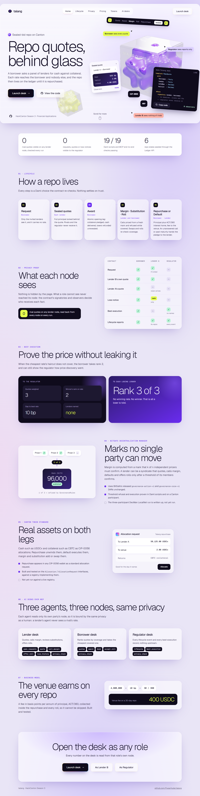
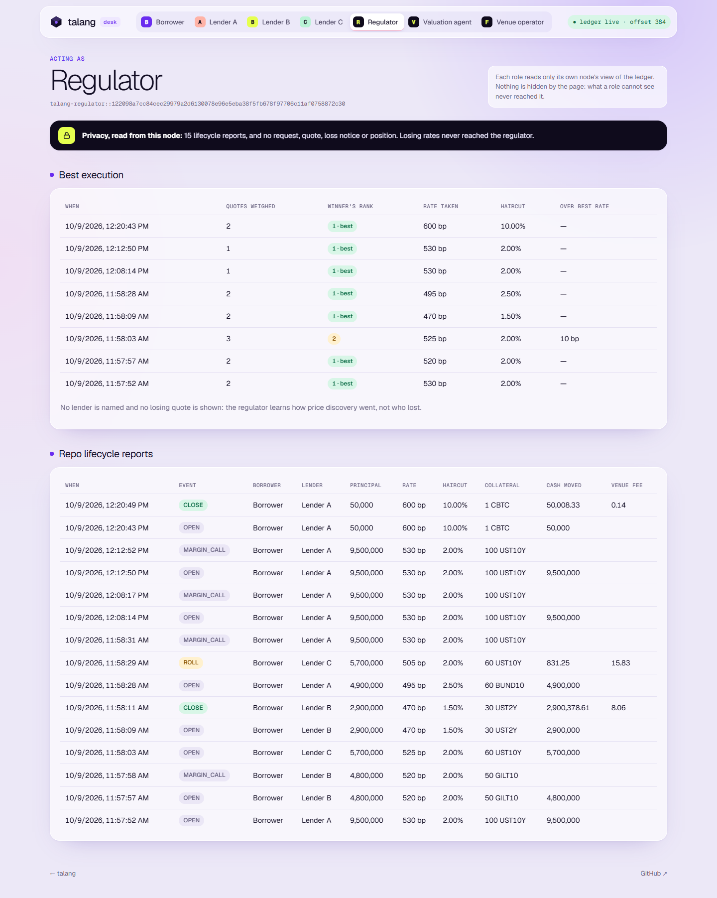

# Talang

A sealed-bid repo desk on Canton. A borrower asks a panel of lenders for cash
against collateral; each lender's rate and haircut reach the borrower and nobody
else. The quote the borrower takes opens a repo that lives on the ledger until it
is repurchased: margin, substitution, rolls, repurchase and default are enforced by
contract, the price source can be a BitSafe decentralized party, and both legs can
be real Canton Token Standard assets such as USDCx and CBTC.

| Step | Who | What the ledger enforces |
|---|---|---|
| Request | borrower | Only the invited lenders see it, and it carries no rate |
| Quote | lender | Full principal locked behind the quote, as a desk escrow or a CIP-0056 allocation; rivals and the regulator never receive it |
| Award | borrower | Opening leg atomic: collateral pledged, cash delivered, losers refunded unrevealed |
| Loss notice | each loser | Told its rank among the quotes weighed, and nothing else: no winning rate, no winner |
| Best execution | regulator | How many quotes were weighed, the winner's rank on rate, the gap to the best rate in bp; no lender named |
| Margin call | lender | Shortfall computed from the valuation agent's mark, refused while the repo is covered |
| Substitution | borrower, then lender | Swap happens only if the substitute covers what is owed at a fresh mark |
| Roll | lender offers, borrower accepts | Interest so far paid now, new rate from today, coverage re-checked at a fresh mark |
| Repurchase | borrower | Principal plus ACT/360 interest to the lender, the venue's fee to the operator, collateral home, change returned |
| Default | lender | After an unanswered call or past maturity, the pledge goes to the lender |
| Report | regulator | Every lifecycle event of an open repo, nothing upstream of it |



The desk is at `/desk` (`?role=lenderB` opens it as a role); the landing page is at `/`.



## What is new in this version

| | Where | Verified |
|---|---|---|
| **CIP-0056 cash and collateral.** Quotes funded by a USDCx (or any registry) `Allocation`; collateral such as CBTC held as an `Allocation` to the lender that stays executable through the claim window. Repurchase unwinds it, default executes it, margin and substitution add or swap allocations. | `daml/Talang.daml` (`Locked`, `SubmitTokenQuote`, `AwardWithTokenCollateral`, `PostTokenMargin`, `ProposeTokenSubstitution`) | 7 scripts in `test/daml/TokenTest.daml` against a registry that implements the real Splice `Allocation` interface |
| **Token repurchase as a wallet request.** `RepurchaseNotice` implements the standard `AllocationRequest`, so any CIP-0056 wallet shows "allocate 50,125 USDCx to the lender and 2.08 to the venue". A notice is good for the day it names. | `RepurchaseNotice`, `VenueAgreement` | `tokenLifecycle`, `staleNotice` |
| **BitSafe Decentralization Manager.** Marks published by a k-of-n valuation committee; a lender that is a k-of-n syndicate quotes, calls margin, defaults and offers rolls only after a threshold of its members confirms. Uses BitSafe's released `governance-action-v1` and `governance-core-v1` DARs unchanged. | `daml/TalangGovernance.daml` | `test/daml/GovernanceTest.daml`; on a Canton participant by `scripts/governance.mjs` ([evidence](docs/evidence/bitsafe-governed-marks-local-sandbox.json)) |
| **Best execution and loss notices.** | `award` in `daml/Talang.daml` | `bestExecution`, and from every node in `npm run e2e:mcp` |
| **Venue fee**, bp per annum ACT/360, inside repurchase and roll. | `Venue`, `Repurchase`, `Roll` | `venueFeeOnRepurchase`, `tokenLifecycle` |
| **Rolls.** | `RollOffer`, `Roll` | `rollToNewRate`, `rollRefusals` |
| **Three MCP desks**: lender, borrower, regulator. | `mcp/server.mjs` | 19 checks in `scripts/e2e-mcp.mjs` on a Canton participant |

## Build and test

```
daml build --all
cd test && daml test        # 19 scripts: core, desk, CIP-0056 tokens, BitSafe governance
```

## Run the whole stack locally, no credentials

```
daml sandbox --json-api-port 7575 --dar .daml/dist/talang-repo-1.0.0.dar --wall-clock-time
npm ci
npm run local                               # allocate the desk's parties on the sandbox
ENV_FILE=.env.local npm run seed            # one repo in every state
ENV_FILE=.env.local npm run e2e:mcp         # every MCP desk, 19 checks, privacy read from each node
ENV_FILE=.env.local npm run governance      # BitSafe 2-of-3 marks through GovernanceRules
ENV_FILE=.env.local npm run token-rail      # USDCx quotes, CBTC collateral, repurchase as an AllocationRequest (needs `daml build --all`)
ENV_FILE=.env.local npm run desk            # http://localhost:8090 (landing), /desk?role=lenderB
```

CI runs exactly this on every push (`.github/workflows/ci.yml`).

## Run the desk on DevNet

Put the M2M client settings in `.env.noders` (gitignored), then `npm run upload`
(talang-repo and BitSafe's governance DARs), `npm run seed`, `npm run e2e:mcp`,
`npm run governance` and `npm run desk`, as above without `ENV_FILE`.
`npm run marks` re-publishes fresh marks; the contract refuses marks older than 24h.

The package is `talang-repo` 1.0.0, a new package name: the `talang-desk` 0.1.0
package from the first commits is still on the NODERS DevNet participant, and this
version changes template shapes in ways a smart-contract upgrade may not.

The hosted copy is read-only: `api/` exposes reads only, scoped to this desk's
parties, and has no submit endpoint.

## AI desk agents (MCP)

`mcp/server.mjs` puts Claude at one desk. It reads only that party's node, so it is
bound by the same privacy as a human: a lender's agent never sees a rival's rate,
and the regulator's agent sees reports and nothing upstream.

| Role | Tools |
|---|---|
| `lenderA` / `lenderB` / `lenderC` | `portfolio`, `open_requests`, `quote`, `call_margin`, `review_substitution`, `offer_roll`, `loss_history`, `privacy_check` |
| `borrower` | `quotes` (ranked, with coverage), `award` (`"best"` takes the cheapest covered quote), `book` (owed today incl. venue fee), `accept_roll`, `privacy_check` |
| `regulator` | `lifecycle`, `best_execution`, `privacy_check` |

```json
{ "mcpServers": { "talang-borrower": {
  "command": "node", "args": ["<repo>/mcp/server.mjs"], "env": { "TALANG_ROLE": "borrower" } } } }
```

## Sponsor integrations

| | Status |
|---|---|
| **NODERS DevNet / NaaS** | `talang-desk` 0.1.0 live on the HackCanton DevNet participant. `talang-repo` 1.0.0 is built and verified on a Canton 3.4.11 participant; its DevNet run goes in `docs/evidence/` once uploaded. |
| **BitSafe Decentralization Manager** | Valuation committee and lender syndicate as `GovernableAction`s on BitSafe's own `GovernanceRules`. Threshold refusal and execution proven in Daml scripts and on a participant. The three-participant DecMan LocalNet run (committee hosted on all three nodes) is written up in [docs/bitsafe.md](docs/bitsafe.md) and **not yet run**: it needs Docker. |
| **CIP-0056: USDCx, CBTC, Canton Coin** | Both legs implemented through the standard `Allocation` / `AllocationRequest` interfaces, tested against a registry implementing them, in Daml scripts and on a participant ([evidence](docs/evidence/cip56-token-repo-local-sandbox.json)). **Not yet run against a live registry**: that needs DevNet faucet or token-grant access. |
| **Grofty Wallet (CIP-0103)** | The desk connects any CIP-0103 wallet through the official `@canton-network/dapp-sdk` (`web/wallet.js`): commands for the wallet's own party are signed by the wallet via `prepareExecuteAndWait`, so even the read-only hosted copy can act without the server holding a key. **Not yet run with a live wallet**; the bounty asks for a MainNet run with a funded wallet. |

## Prior work disclosure

Talang reuses patterns from [Tirai](https://github.com/PugarHuda/tirai) (HackCanton
Season 2): escrow-on-quote, sealed quotes with no observers, regulator reports, the
CIP-0056 allocation settlement and its mock registry. Talang itself is new work for
HackCanton Season 3: the first commit is 2 October 2026, inside the delivery phase
(18 September to 9 October). `git log` is the record.
